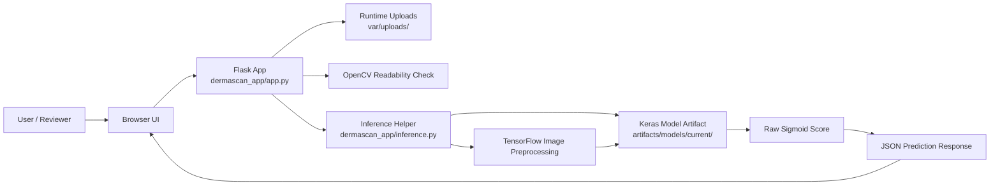
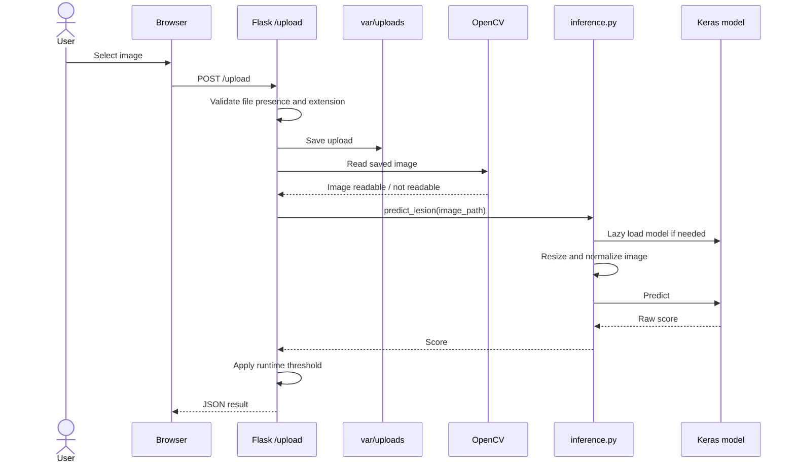
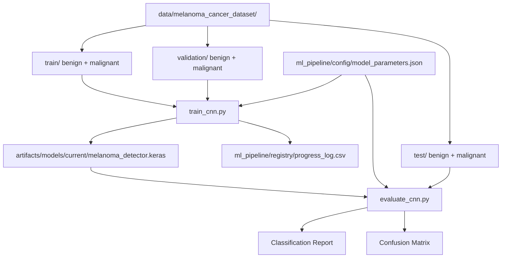
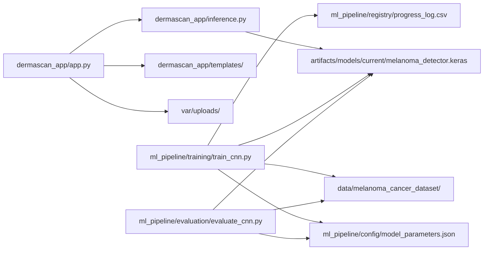
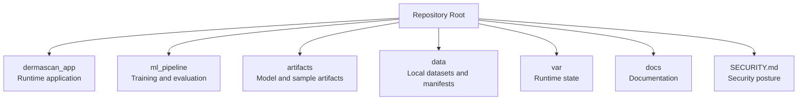

# UML And Diagrams

This document provides Mermaid diagrams for the DermaScan prototype. GitHub can render these diagrams directly.

## High-Level System Architecture



## Main Inference Sequence



## Training And Evaluation Data Flow



## Module Dependency Diagram



## Class And Module View

The current codebase is script/module-oriented rather than object-oriented. This diagram models modules and major functions.

```mermaid
classDiagram
    class FlaskApp {
        +allowed_file(filename) bool
        +home()
        +about()
        +education()
        +contact()
        +disclaimer()
        +upload_file()
    }

    class InferenceModule {
        +load_model()
        +predict_lesion(image_path) float
    }

    class TrainingScript {
        +plot_metrics(history)
        +log_metrics(history, conf_matrix)
    }

    class EvaluationScript {
        +load test dataset
        +load model artifact
        +classification_report()
        +confusion_matrix()
    }

    FlaskApp --> InferenceModule : calls
    InferenceModule --> "Keras Model" : loads
    TrainingScript --> "Keras Model" : writes
    EvaluationScript --> "Keras Model" : reads
```

## Repository Responsibility Map



